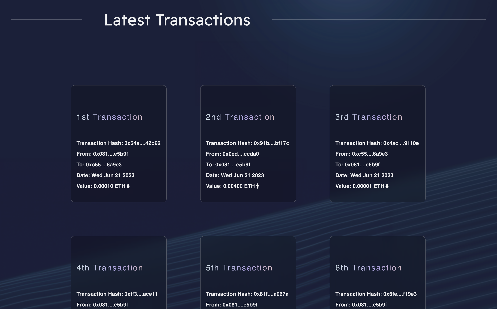

<!DOCTYPE html>
<html>

<body>
  <h1>CryptoNet Website</h1>

  
Welcome to the CryptoNet website! This project aims to provide a user-friendly platform for those interested in digital currencies to manage their accounts and stay updated with the latest market trends. The website consists of several key pages, including the Get Started page, Trade page, and Market page.

  <h2>Table of Contents</h2>
  <ul>
    <li><a href="#features">Features</a></li>
    <li><a href="#installation">Installation</a></li>
    <li><a href="#usage">Usage</a></li>
    <li><a href="#dependencies">Dependencies</a></li>
    <li><a href="#contributing">Contributing</a></li>
    <li><a href="#responsive">Responsive Design</a></li>
  </ul>
  

  <h2 id="features">Features</h2>

  <h3>Get Started Page</h3>
  <ul>
    <li>Introduction and Setup Guide to Get Started Quickly and Easily.</li>
     
    
  </ul>

  <h3>Trade Page</h3>
  <ul>
    <li>Users can connect their MetaMask wallet to their account.</li>
    <li>Transfer Ethereum currency to other addresses.</li>
     
    
     
    <li>Latest transactions are displayed at the bottom of the page.</li>
     
    
  </ul>

  <h3>Market Page</h3>
  <ul>
    <li>Displays the price, market cap, and 24h price change of cryptocurrencies in a table format.</li>
     
    
  </ul>

  <h2 id="installation">Installation</h2>

  <ol>
    <li>Clone the repository:</li>
  </ol>

  <pre><code>git clone https://github.com/Yasser3085/CryptoNet-client.git
  </code></pre>

  <ol start="2">
    <li>Navigate to the project directory:</li>
  </ol>

  <pre><code>cd cryptoNet-client
  </code></pre>

  <ol start="3">
    <li>Install the dependencies:</li>
  </ol>

  <pre><code>npm install
  </code></pre>

  <ol start="4">
    <li>Start the development server:</li>
  </ol>

  <pre><code>npm run dev
  </code></pre>

 or you can visit the website by this url https://cryptnet.netlify.app/ 

 <h2 id="dependencies">Dependencies</h2>

  
The project relies on the following dependencies:

  <ul>
    <li>REACT: JavaScript library for building user interfaces.</li>
    <li>ETHER.JS: Library for interacting with Ethereum.</li>
    <li>CHAKRA UI: UI component library for React.</li>
    <li>Node.js: JavaScript runtime for building server-side applications.</li>
  </ul>

  
For detailed versions of the dependencies, please refer to the <code>package.json</code> file.

  <h2 id="responsive">Responsive Design</h2>

  
The website is designed to be responsive, adapting to different screen sizes and devices.

 

  

  <h2 id="contributing">Contributing</h2>

  
Contributions to this project are welcome! If you encounter any issues or have suggestions for improvements, please open an issue or submit a pull request.

</body>

</html>
